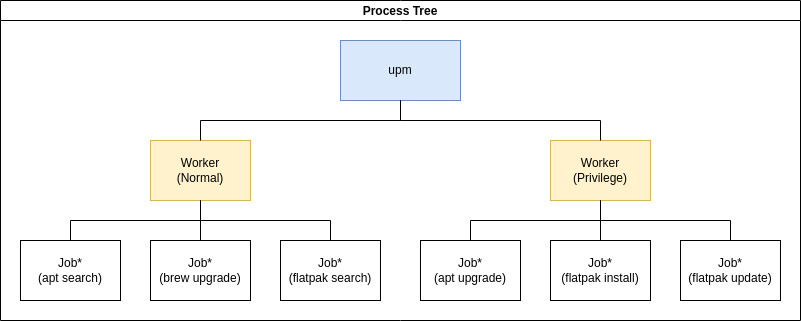
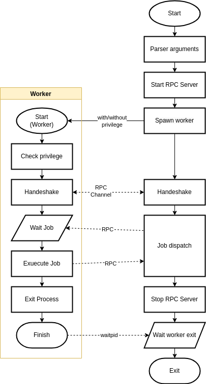

# Technical Details

## Architecture

The overview process tree of upm draw as follows.

The upm execute self twice (named as `worker`) on startup: one as normal user, one as root user. These two worker take care of execute the real package manager command.

## Command line arguments

